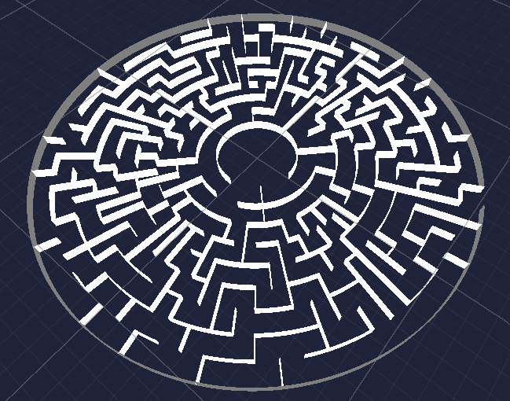
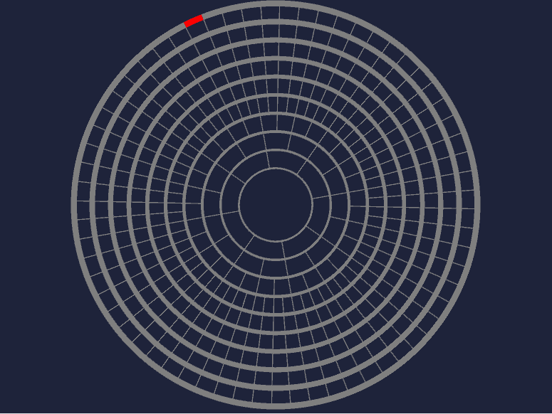
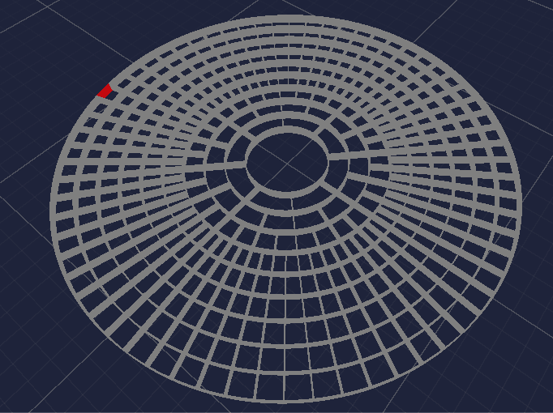

# Circular Maze Generator

## Description
Projet Github réalisé dans le cadre du cours de Mondes virtuels - Génération procédurale de Gilles Gesquiere du Master Gamagora.

`Circular Maze Generator` est un projet qui utilise l'algorithme de DFS pour générer des labyrinthes circulaires. 

Ce projet vise à explorer les capacités de la génération procédurale pour créer des puzzles uniques et stimulants.

  

  

## Installation et Compilation

### Prérequis

- Unity 2022.3 LTS ou plus récent
  
### Instructions de compilation :

- Cloner le dépôt : git clone `https://github.com/zouiqad/circular-maze-generator`
- Ouvrir le dossier sur Unity
- Ouvrir la scène appelée `DemoScene`
- (optionnel) Jouer avec les paramètres de génération en cliquant sur le "GameManager"
- Lancer la scène

## Documentation

### L'algorithme utilisé

L'algorithme DFS (Depth-First Search, ou Parcours en Profondeur) est utilisé dans le générateur de labyrinthe circulaire pour créer le labyrinthe lui-même.

Dans le contexte de la génération de labyrinthes, le DFS commence à une cellule aléatoire et explore aussi loin que possible le long de chaque branche avant de revenir en arrière. Ce processus est répété jusqu'à ce que l'ensemble du labyrinthe ait été exploré. Le résultat est un labyrinthe parfait, c'est-à-dire qu'il existe un seul chemin entre deux cellules et qu'il n'y a pas de boucles.

L'algorithme DFS est un choix populaire pour la génération de labyrinthes en raison de sa simplicité et du fait qu'il génère des labyrinthes avec un facteur "rivière" élevé, ce qui signifie qu'ils ont de longs couloirs sinueux.

### Documentation du Projet Unity

Projet visant à créer un labyrinthe circulaire en utilisant Unity pour permettre de "gamifier" cette génération procédurale. Le labyrinthe est construit à partir de segments circulaires, formant des anneaux concentriques avec des chemins entre eux.

#### **Composants Principaux**

1. **GameManager**
    - **Responsabilité** : Contrôle la génération du labyrinthe et gère les différents composants.
    - **Fonctionnalités** :
        - Crée des anneaux concentriques.
        - Initialise et coordonne la génération des cellules du labyrinthe.
        - Crée des murs courbés et plats pour représenter les chemins du labyrinthe.
        - Gère le démarrage de la génération du labyrinthe.

2. **Maze**
    - **Responsabilité** : Implémente l'algorithme de DFS pour créer les chemins du labyrinthe.
    - **Fonctionnalités** :
        - Génère les chemins à travers les cellules du labyrinthe.
        - Utilise un algorithme de DFS pour connecter les cellules et former le labyrinthe.
        - Identifie aléatoirement une sortie dans l'anneau extérieur pour démarrer la génération.

3. **MazeCell**
    - **Responsabilité** : Représente une cellule individuelle du labyrinthe.
    - **Fonctionnalités** :
        - Gère les murs avant et gauche de chaque cellule.
        - Permet d'initialiser les cellules avec des paramètres de position.
        - Active ou désactive les murs avant et gauche de la cellule.
        - Chaque cellule contient un mur à gauche et un mur courbé.

4. **CurvedWall**
    - **Responsabilité** : Génère les murs courbés pour les segments du labyrinthe.
    - **Fonctionnalités** :
        - Crée des murs courbés en fonction des paramètres tels que le rayon, l'angle et la hauteur spécifiés.
        - Génère un maillage représentant les murs courbés.
        - Configure un MeshCollider pour permettre la détection de collision.

#### **Fonctionnement Général**

1. Le GameManager est chargé de créer les anneaux concentriques du labyrinthe.
2. Chaque anneau est composé de cellules représentées par des MazeCells.
3. Le Maze utilise un algorithme de DFS pour créer des chemins à travers les cellules.
4. Les murs sont représentés par des CurvedWalls pour former la géométrie du labyrinthe.
5. Le projet utilise des maillages pour rendre les murs visibles et un MeshCollider pour détecter les collisions.
6. Chaque cellule contient un mur à gauche et un mur courbé.
7. Le nombre de cellules par anneau dépend du nombre de segments de l'anneau, chaque anneau étant segmenté en plusieurs parties (paramètres utilisateur).

### Partie du code importante

`private IEnumerator VisitCell(int ring, int segment)
    {
        activeCoroutines++;

        visited[ring][segment] = true;

        // Get a list of all neighbors, shuffle it to ensure random order
        List<(int, int)> neighbors = GetUnvisitedNeighbors(ring, segment);
        Shuffle(neighbors);  // Shuffle the list

        yield return new WaitForSeconds(delay);
        foreach (var neighbor in neighbors)
        {
            ColorCell(neighbor, Color.yellow);

        }

        foreach (var neighbor in neighbors)
        {
            // Get neighbor ring and segment
            (int neighborRing, int neighborSegment) = neighbor;

            ColorCell(neighbor, Color.white);

            // If the neighbor has not been visited
            if (!visited[neighborRing][neighborSegment])
            {
                // Remove the wall between the current cell and the chosen cell
                StartCoroutine(RemoveWallBetween(ring, segment, neighborRing, neighborSegment));

                // Recursively visit the chosen cell
                yield return StartCoroutine(VisitCell(neighborRing, neighborSegment));
            }
        }
        activeCoroutines--;
        // If this was the last active coroutine, call the completion method
        if (activeCoroutines == 0)
        {
            CoroutineComplete();
        }
    } 
    `
La methode `VisitCell` dans `Maze.cs` illustre comment l'algorithme Depth-First Search (DFS) est implémenté pour la génération de labyrinthe. Voici les points clés :

   - Marquage des Cellules Visitées : Chaque cellule visitée est marquée comme telle pour éviter les répétitions.

   - Traitement des Voisins : Il récupère une liste de voisins non visités et la mélange pour assurer un ordre de visite aléatoire.

   - Attente et Coloration : Après une attente (WaitForSeconds), il colore les cellules voisines, indiquant leur exploration.

   - Visite Récursive des Voisins : Pour chaque voisin non visité, il supprime le mur entre la cellule actuelle et le voisin, puis visite récursivement ce voisin en utilisant StartCoroutine.

   - Gestion des Coroutine : Il suit le nombre de coroutines actives et appelle CoroutineComplete lorsque toutes les coroutines sont terminées.

### Reference travaux et positionement

Voici le lien vers les travaux et recherches que nous avons utilisés et consultés pour notre projet :

[Maze Generation Algorithm - Depth First Search](https://www.algosome.com/articles/maze-generation-depth-first.html)

[Circular Maze using Depth First Search ft. The Maze Runner](https://www.youtube.com/watch?v=q7t8UVlu-Fk)

Dans nos recherches, nous avons constaté que la plupart des travaux existants ne correspondaient pas entièrement à nos objectifs. 

Le premier lien consulté menait à un projet Python en 2D, tandis que l'autre se focalisait sur un labyrinthe carré, ce qui est courant dans ce domaine.

Nous avons alors pris l'initiative de développer notre propre logique pour un labyrinthe circulaire en implementant une version recursive de l'algorithme DFS. En outre, nous avons conçu et créé des maillages spécifiques pour les murs courbés, afin de réaliser notre vision unique pour ce projet.

## **Conclusion**

Ce projet de génération de labyrinthe circulaire utilise des composants pour créer un labyrinthe complexe à partir de segments circulaires. L'utilisation de l'algorithme de DFS et de la génération de maillage permet de créer un labyrinthe unique et jouable dans l'environnement Unity, notamment pour notre jeu s'inspirant du film "Le Labyrinthe" de Wes Ball.

  

